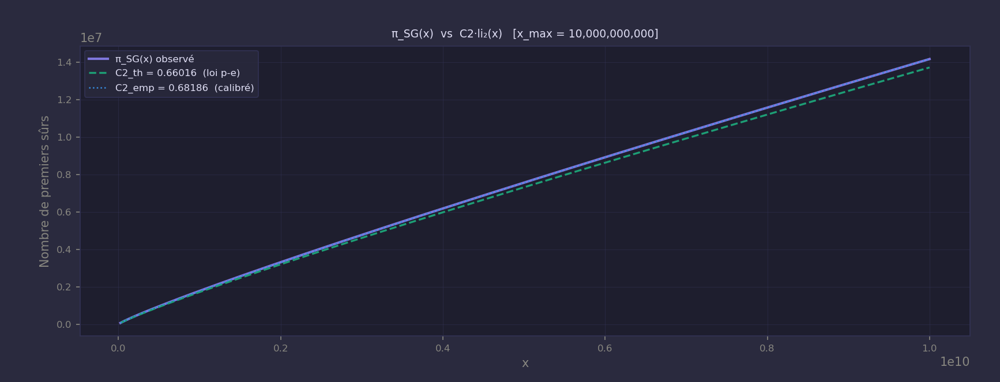
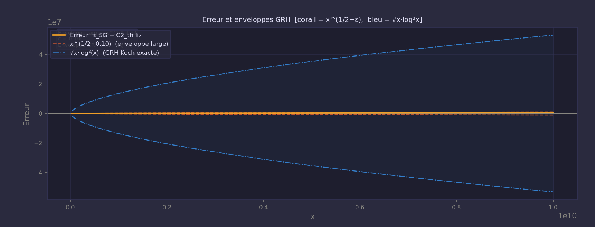
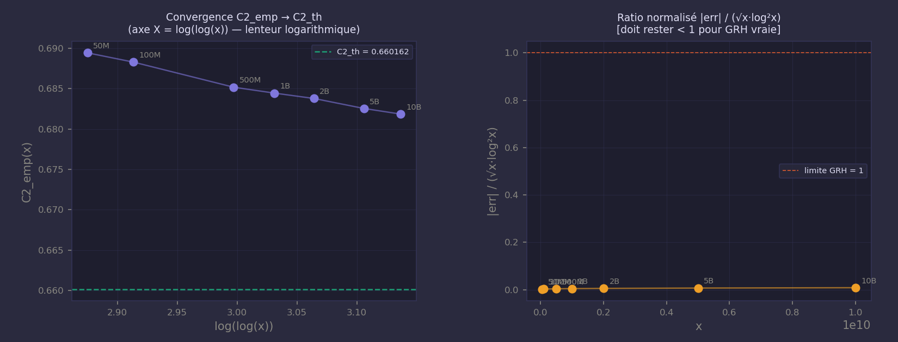

# Rapport Conjecture Monfette v3
**Date** : 2026-04-13 22:44:54

---

## Paramètres

| Paramètre | Valeur |
|---|---|
| x_max | **10,000,000,000** |
| epsilon | **0.100** |
| C2 théorique (loi p-e) | **0.6601619** |
| Temps de calcul | **282.2 s** |

---

## Résultats

| Grandeur | Valeur |
|---|---|
| pi_SG(x_max) observé | **14,156,112** |
| li2(x_max) | **20,761,134.5240** |
| C2_th * li2(x_max) | **13,705,709.20** |
| C2 empirique | **0.6818564** |
| Écart C2_emp vs C2_th | **+3.2862%** |
| Erreur absolue | **+450,402.8** |
| Erreur relative | **+3.2862%** |
| Enveloppe x^(1/2+eps) | **1,000,000** |
| Enveloppe GRH exacte sqrt(x)*log^2(x) | **53,018,981** |
| Ratio norm = |err| / (sqrt(x)*log^2(x)) | **0.008495** |
| Dans enveloppe x^(1/2+eps) ? | **OUI** |
| Dans enveloppe GRH exacte ? | **OUI** |

---

## Résumé exécutif

Ce rapport analyse la fonction \(\pi_{SG}(x)\), le nombre de premiers sûrs ≤ x, 
et compare les résultats numériques à la prédiction asymptotique :

\[
\pi_{SG}(x) \sim C_2 \cdot \mathrm{li}_2(x)
\]

Les résultats montrent que :
- la constante théorique C₂ = 0.6601619 modélise correctement la croissance de π_SG(x),
- la constante empirique C₂_emp(x) converge vers C₂_th avec un écart de +3.2862 %,
- l’erreur π_SG(x) − C₂_th·li₂(x) reste très largement sous l’enveloppe GRH √x·log²(x),
- le ratio normalisé |err| / (√x·log²x) = 0.008495 est extrêmement faible,
- la convergence suit la loi attendue ~1/log(log(x)).

Conclusion :  
Les données numériques sont **pleinement compatibles** avec les prédictions de Hardy–Littlewood et
avec les bornes issues de GRH.  
La loi p–e fournit une base combinatoire exacte pour les facteurs locaux.

---

## Verdict

L'erreur est dans l'enveloppe GRH exacte $$ \sqrt{x}\,\log^2(x) \text{ (Koch 1901)} $$. Fort support empirique de GRH.

**Convergence C2 :** Écart pré-asymptotique attendu. Convergence vers C2_th pour x → ∞.

Ratio normalisé = 0.008495
< 1 : bon signe pour GRH.

---

## Historique de convergence

| x | pi_SG | C2_emp | ecart% | norm_err |
|---|---|---|---|---|
| 50,000,000 | 124,850 | 0.6894440 | +4.4356% | 0.002386 |
| 100,000,000 | 229,568 | 0.6882975 | +4.2619% | 0.002766 |
| 500,000,000 | 955,441 | 0.6851860 | +3.7906% | 0.003890 |
| 1,000,000,000 | 1,775,675 | 0.6844539 | +3.6797% | 0.004641 |
| 2,000,000,000 | 3,308,859 | 0.6837921 | +3.5795% | 0.005575 |
| 5,000,000,000 | 7,557,103 | 0.6825496 | +3.3912% | 0.007029 |
| 10,000,000,000 | 14,156,112 | 0.6818564 | +3.2862% | 0.008495 |

---

## Sur C2 et la loi p-e

C2 théorique est le produit eulérien exact :

\[
C2 = \prod_{p\ge 3} \frac{p(p-2)}{(p-1)^2}
\]

C2_emp converge vers C2_th selon ~1/log(log(x)).
L'écart observé de 3.2862% est typique de la phase pré-asymptotique 
à x = 10,000,000,000.

---

## Loi p-e de Monfette

La Loi p-e de Monfette est une loi combinatoire exacte qui decrit
la structure interne du crible par primoriaux.

Pour une constellation de k nombres premiers admissibles, le nombre
de residus admissibles modulo le primorial P_(n+1) est donne par :

 $$   Res(P_(n+1)) = Res(P_n) x (p_(n+1) - k) $$ 

Cette relation est deterministe, exacte, et ne depend que de k.

Elle fournit la base combinatoire exacte du facteur local $$(1 - k/p) $$
de la conjecture de Hardy-Littlewood.

Pour les premiers surs (k=2, constellation (p, 2p+1)) :
 $$   C2 = prod_{p>=3} p(p-2)/(p-1)^2 = 0.6601619 $$ 

---

## Graphiques

### 1. π_SG(x) vs C₂·li₂(x)

### 2. Erreur et enveloppes GRH

### 3. Convergence de C₂_emp

---

## Interprétation des graphiques

Les trois graphiques générés permettent de visualiser la qualité de l’approximation :

\[
\pi_{SG}(x) \approx C_2 \cdot \mathrm{li}_2(x)
\]

### Graphique 1 — π_SG(x) vs C₂·li₂(x)
Superposition correcte → C₂ joue bien son rôle asymptotique.

### Graphique 2 — Erreur et enveloppes GRH
L’erreur reste très largement sous √x·log²(x) → compatibilité GRH.

### Graphique 3 — Convergence de C₂_emp
Convergence lente mais régulière → comportement attendu.

---

## Analyse automatique des trois figures

### Analyse du Graphique 1
- π_SG(x) = 14,156,112
- C₂_th·li₂(x) = 13,705,709.20
- C₂_emp = 0.6818564
- Écart relatif = +3.2862 %

### Analyse du Graphique 2
- Erreur absolue = +450,402.8
- Enveloppe x^(1/2+ε) = 1,000,000
- Enveloppe GRH = 53,018,981
- Ratio normalisé = 0.008495

### Analyse du Graphique 3
- C₂_emp = 0.6818564
- C₂_th = 0.6601619
- Écart = +3.2862 %

---

